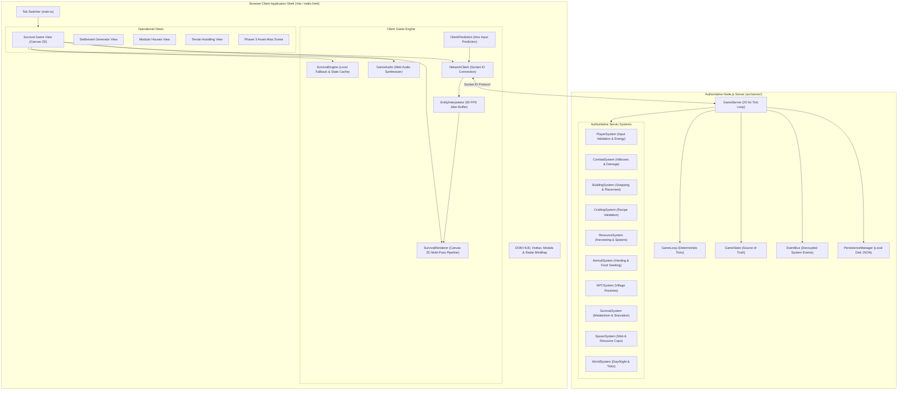
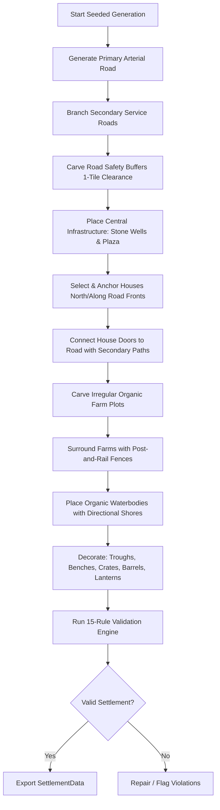

# Sunnyside 2D Survival & RTS — Codebase Implementation & Architecture Specification

> **Document Version:** 1.0.0  
> **Repository:** RTSGame (`Shanukeshri/SunnySide-World`)  
> **Engine & Stack:** TypeScript 5.7, Canvas 2D, Phaser 3.88, Node.js + Socket.IO 4.8, Web Audio API, Vite 6.2  
> **Assets Pack:** Sunnyside World Asset Pack v2.1  

---

## Table of Contents

1. [Executive Summary & High-Level Architecture](#1-executive-summary--high-level-architecture)
2. [Application Shell & Five Operational Views](#2-application-shell--five-operational-views)
3. [Core Simulation Engine (`SurvivalEngine.ts`)](#3-core-simulation-engine-survivalenginets)
4. [Procedural World Generation & Chunk Streaming (`WorldManager.ts`)](#4-procedural-world-generation--chunk-streaming-worldmanagerts)
5. [Procedural Settlement & Village Generator (`SettlementGenerator.ts`)](#5-procedural-settlement--village-generator-settlementgeneratorts)
6. [High-Performance Canvas 2D World Renderer (`SurvivalRenderer.ts`)](#6-high-performance-canvas-2d-world-renderer-survivalrendererts)
7. [Living Entities & Wildlife AI Ecosystem (`src/lifeforms/`)](#7-living-entities--wildlife-ai-ecosystem-srclifeforms)
8. [Authoritative Multiplayer Architecture (`src/server/` & `src/client/`)](#8-authoritative-multiplayer-architecture-srcserver--srcclient)
9. [Zero-Dependency Procedural Audio Synthesis (`GameAudio.ts`)](#9-zero-dependency-procedural-audio-synthesis-gameaudiots)
10. [Visual Asset Atlas & Inspection Scene (`AtlasScene.ts`)](#10-visual-asset-atlas--inspection-scene-atlasscenets)
11. [HUD, Radar MiniMap & In-Game Modals (`src/main.ts`)](#11-hud-radar-minimap--in-game-modals-srcmaints)
12. [Complete File Registry & Code Responsibilities](#12-complete-file-registry--code-responsibilities)
13. [Verification, Milestones & Roadmap](#13-verification-milestones--roadmap)

---

## 1. Executive Summary & High-Level Architecture

This project is a hybrid **top-down 2D survival sandbox, procedural village simulation, and authoritative multiplayer sandbox** inspired by classic 16-bit sandbox RPGs (such as *Minecraft 2D*, *Terraria*, and *Stardew Valley*). Built from the ground up using **TypeScript**, the codebase operates in both:
1. **Client-Side Simulation / Standalone Mode**: Fully functional local simulation running directly in the browser via Canvas 2D with zero latency.
2. **Authoritative Multiplayer Mode**: Fully authoritative Node.js server running a deterministic 20 Hz simulation tick, with Socket.IO communication, client-side input prediction, server reconciliation, and snapshot entity interpolation.

### High-Level Architecture Diagram



---

## 2. Application Shell & Five Operational Views

The client provides five primary operational views toggled dynamically via a sleek top tab bar in [`index.html`](file:///Users/shanukeshri983/Desktop/RTSGame/index.html) managed by [`src/main.ts`](file:///Users/shanukeshri983/Desktop/RTSGame/src/main.ts):

| Tab | View ID | Description | Technology |
| :--- | :--- | :--- | :--- |
| **Survival Game** | `game-view` | Complete top-down survival sandbox with exploration, gathering, crafting, building, combat, wildlife, day/night lighting, and multiplayer synchronization. | HTML5 Canvas 2D + Custom Renderer |
| **Village Generator** | `settlement-view` | Algorithmic procedural village builder showcasing flat plain terrain, road-first spine layouts, irregular organic farm plots, 16 distinct house types, and wildlife roaming. | Canvas 2D |
| **Houses** | `houses-view` | Modular house gallery demonstrating multi-tier architectural varieties from [`houses.png`](file:///Users/shanukeshri983/Desktop/RTSGame/houses.png) with roofs, walls, chimneys, and balconies. | Canvas 2D |
| **Terrain & Biome** | `terrain-view` | Interactive dual-layer marching squares / autotiling terrain chunk generator demonstrating seamless grass, dirt, sand, and water transitions. | Canvas 2D |
| **Assets Map** | `assets-map-view` | Full-screen interactive asset catalog inspecting 269+ sliced assets from the Sunnyside World asset pack with pan, zoom, search, and category jumping. | Phaser 3.88 |

---

## 3. Core Simulation Engine (`SurvivalEngine.ts`)

The [`SurvivalEngine`](file:///Users/shanukeshri983/Desktop/RTSGame/src/game/SurvivalEngine.ts) (1,714 lines) is the central state container and local simulation kernel for single-player play and authoritative client caching.

### 3.1 Vitals & Player Survival Mechanics
The player's physiological systems are simulated continuously per frame:

- **Health ($0 - 100$)**:
  - Drops from enemy attacks, starvation damage, or hazards.
  - Automatically regenerates at $+1.5\text{ HP/sec}$ if hunger is above $80\%$.
  - Reaching $0\text{ HP}$ triggers `isDead = true`, displaying the **YOU DIED** game-over screen with a **RESPAWN** option.
- **Hunger ($0 - 100$)**:
  - Decreases at a metabolic rate of $-0.4\text{ points/sec}$ (accelerated to $-0.8\text{ points/sec}$ during sprinting).
  - Starvation: When hunger drops to $0$, the player suffers direct physical damage at $-2\text{ HP/sec}$.
  - Feeding: Restored by eating berries ($+15$), apples ($+20$), bread ($+35$), raw fish ($+15$), grilled fish ($+45$), or roasted meat ($+45$).
- **Stamina ($0 - 100$)**:
  - Consumed during sprinting ($-18\text{ stamina/sec}$), rolling/dodging ($-20\text{ stamina}$), or heavy tool swings ($-5\text{ stamina}$).
  - Regenerates when walking ($+12\text{ stamina/sec}$) or resting/idle ($+22\text{ stamina/sec}$).
  - Exhaustion occurs at $0\text{ stamina}$, forcing the player to drop from sprint to normal walk speed.
- **Progression & Leveling**:
  - Gained through resource harvesting ($+5\text{ XP}$ per chop/mine), monster kills ($+30\text{ XP}$), crafting ($+15\text{ XP}$), and building ($+10\text{ XP}$).
  - Exponential level threshold formula:
    $$\text{Target XP} = 100 \times 1.45^{(\text{Level} - 1)}$$

### 3.2 Inventory & Hotbar System
- **Total Capacity**: 24 slots (Slots $0-7$: Active Hotbar accessible via numeric keys `1-8`; Slots $8-23$: Extended Backpack storage accessible via `Tab` or `I`).
- **Stack Limits**:
  - Raw Resources (wood, stone, iron, coal, fibers): Stack up to $99$.
  - Food & Consumables: Stack up to $30 - 50$.
  - Tools & Weapons: Non-stackable (Stack limit of $1$) with individual durability bars.
- **Durability System**:
  - Every tool swing against a resource or entity depletes $1$ durability point.
  - Reaching $0$ durability breaks the tool with an audible crunch and removes it from inventory.

### 3.3 Catalog of Items & Crafting Recipes
The engine defines a structured catalog of 31 items in [`ITEM_CATALOG`](file:///Users/shanukeshri983/Desktop/RTSGame/src/game/SurvivalEngine.ts#L32) and 18 recipes in [`CRAFTING_RECIPES`](file:///Users/shanukeshri983/Desktop/RTSGame/src/game/SurvivalEngine.ts#L89):

```typescript
// Example Recipe Definition
{
  id: "campfire",
  name: "Campfire",
  result: "campfire",
  count: 1,
  ingredients: [
    { item: "wood", count: 3 },
    { item: "stone", count: 4 },
    { item: "fiber", count: 2 }
  ],
  category: "survival"
}
```

- **Crafting Stations**:
  - Hand-Crafting: Sticks, Torches, Campfires, Workbenches, Wooden Tools.
  - Workbench Required: Stone & Iron Tools, Weapons, Storage Chests, Wooden Wall/Floor/Door building pieces.

### 3.4 Building & Structure Placement System
- **Snapping**: All placed structures snap to the world's $16 \times 16\text{ px}$ grid.
- **Validation**:
  - Obstruction checks against static terrain (water, rocks) and existing structures.
  - Proximity check ensuring the player is within $5.0$ tiles of the placement target.
  - Inventory requirement: Consumes the corresponding building item upon confirmation.
- **Structure Entities**:
  - `wood_wall`: Solid physical barrier with collision.
  - `wood_floor`: Cosmetic foundation tile without collision.
  - `wood_door`: Interactive structure toggling between Open (passable) and Closed (colliding) via `[E]`.
  - `campfire`: Emits warm radial lighting at night and serves as a cooking station.
  - `chest`: 16-slot container with persistent item storage.
  - `workbench`: Crafting station expanding recipe availability.

### 3.5 Resource Gathering & Dropped Item Physics
- **Resource Nodes**:
  - Oak Trees (Yield: Oak Wood + Sticks + occasional Apples).
  - Boulders (Yield: Cobblestone + Coal).
  - Iron Veins (Yield: Iron Ore + Cobblestone).
  - Berry Bushes (Yield: Sweet Berries).
- **Physical Feedback**:
  - Hit Wobble: Angled sinusoidal oscillation on impact ($\pm 8^{\circ}$) that damps over $0.25\text{s}$.
  - Particle Splashes: Emits 3 to 6 wood chips or stone shards in the direction of the blow.
- **Dropped Items Physics**:
  - Spawns with a radial impulse velocity $(v_x, v_y)$.
  - Friction deceleration brings items to rest.
  - Sinusoidal levitation bob: $y_{\text{offset}} = \sin(4 \cdot t) \times 3\text{ px}$.
  - **Magnet Attraction**: When the player approaches within $2.2$ tiles, the item accelerates directly toward the player's center:
    $$a_x = \frac{x_{\text{player}} - x_{\text{item}}}{d} \times 8.0, \quad a_y = \frac{y_{\text{player}} - y_{\text{item}}}{d} \times 8.0$$
  - Auto-pickup chime plays when distance $< 0.5$ tiles and inventory has space.

### 3.6 Day/Night Cycle & Ambient Phases
A continuous clock runs at $1\text{ real second} = 1\text{ in-game minute}$ ($1\text{ full in-game day} = 24\text{ real minutes}$):
- **Dawn ($05:00 - 08:00$)**: Golden-amber ambient tint ($\text{RGBA}(245, 170, 90, 0.15)$).
- **Noon ($08:00 - 17:00$)**: Clear, bright natural daylight ($\text{RGBA}(0, 0, 0, 0.0)$).
- **Dusk ($17:00 - 20:00$)**: Deep twilight purple-orange tint ($\text{RGBA}(180, 70, 110, 0.28)$).
- **Night ($20:00 - 05:00$)**: Deep midnight blue darkness ($\text{RGBA}(8, 12, 28, 0.86)$).

---

## 4. Procedural World Generation & Chunk Streaming (`WorldManager.ts`)

The [`WorldManager`](file:///Users/shanukeshri983/Desktop/RTSGame/src/game/WorldManager.ts) (760 lines) orchestrates the infinite-feeling, deterministic chunked world.

### 4.1 Seeded Mathematics & Noise
- **Mulberry32 PRNG**: Deterministic, 32-bit state seeded pseudo-random generator guaranteeing reproducible world generation across client and server.
- **2D Smooth Gradient Noise**: Custom Simplex/Perlin noise with quintic Hermite smoothing curve:
  $$f(t) = 6t^5 - 15t^4 + 10t^3$$

### 4.2 Chunk Streaming Architecture
- **Chunk Dimensions**: $16 \times 16$ logical tiles per chunk.
- **Streaming Radius**: Dynamic window of $5 \times 5$ chunks loaded around the player's active coordinate. Unused distant chunks are pruned to maintain constant memory overhead.
- **Biomes & Terrain Distribution**:
  - Water & Lakes: Triggered when $Noise_{\text{water}}(x, y) < 0.26$.
  - Sand / Shoreline: Border buffer around water bodies.
  - Grassland: Primary fertile ground with $6$ textured grass sprite variations.
  - Dense Forest / Jungle: Spawned when $Noise_{\text{forest}}(x, y) > 0.58$ (enforces clusters of $\ge 20$ trees).
  - Stone & Mineral Outcrops: Spawned on higher elevation noise thresholds.

### 4.3 Realm Village Placement & Strict Gap Constraint
The world enforces a strict architectural rule specified in [`gameLogicV1.txt`](file:///Users/shanukeshri983/Desktop/RTSGame/gameLogicV1.txt):
> **Rule:** Wilderness gap between any two villages must be strictly between 2 and 4 village equivalents ($1\text{ village equivalent} \approx 40\text{ tiles}$, meaning a gap between $80$ and $160$ tiles). Maximum 4 realm villages across the world.

The candidate sites are deterministically planned at:
1. **Village 1 (Oakvale)**: Starting realm village at $[0, 0]$.
2. **Village 2 (Riverwood)**: East/Northeast at $[+96, -48]$ ($\Delta \approx 107\text{ tiles} \approx 2.68\text{ V}$).
3. **Village 3 (Sunhaven)**: South/Southeast at $[+48, +110]$ ($\Delta \approx 120\text{ tiles} \approx 3.0\text{ V}$).
4. **Village 4 (Pinecrest)**: West/Northwest at $[-96, -64]$ ($\Delta \approx 115\text{ tiles} \approx 2.88\text{ V}$).

---

## 5. Procedural Settlement & Village Generator (`SettlementGenerator.ts`)

The [`SettlementGenerator`](file:///Users/shanukeshri983/Desktop/RTSGame/src/generation/SettlementGenerator.ts) (1,758 lines) builds organic, believable medieval settlements directly from the Sunnyside assets pack.

### 5.1 Road-First Generation Pipeline


### 5.2 House Catalog & Architectural Rules
16 distinct house varieties are indexed with individual footprints, doors, and rarity weights:
- Thatched Cottage ($3 \times 3$), Farmstead Manor ($4 \times 3$), Barn ($4 \times 3$), Workshop ($4 \times 3$), Village Tavern ($4 \times 4$), General Store ($4 \times 3$), Windmill ($4 \times 4$), Manor Mansion ($5 \times 4$), Hunter Cabin ($3 \times 3$), Castle Keep ($5 \times 5$), Chapel ($4 \times 4$), Stables ($4 \times 3$), Warehouse ($4 \times 3$), Merchant House ($4 \times 3$), Blacksmith Forge ($4 \times 3$), Coastal Lighthouse ($3 \times 4$).

**Placement Constraints**:
- **Frontage Rule**: Houses are predominantly placed north of east-west roads or alongside north-south roads so their entrance facade and door remain unobstructed.
- **Separation Distance**: Minimum $2.5$ tile buffer between exterior walls of adjacent houses.
- **Doorway Connectivity**: Every house door has an A* or direct path connecting it to the nearest public road.

### 5.3 Directional Shoreline & Water Math
Water bodies use dynamic 8-neighbor bitmasking to assign rotated shore transitions:
- Corners and edges calculate rotation angle $\theta \in \{0, \frac{\pi}{2}, \pi, \frac{3\pi}{2}\}$ so water tiles seamlessly blend into grassy shores without pixel artifacts or blocky edges.

### 5.4 Automated 15-Rule Validation Engine
Before any generated settlement is finalized, the `ValidationReport` checks:
1. `flatTerrain`: 100% flat plain foundation.
2. `noIsometricBlocks`: Zero isometric assets on orthogonal grid.
3. `noElevationAssets`: No cliff/stair assets breaking 2D flat plane.
4. `gridAligned16px`: Every structure aligned strictly to 16px multiples.
5. `roadsGeneratedFirst`: Primary spine road verified before structure anchor.
6. `sparseRoadsGaps`: Minimum 3-tile open space between parallel paths.
7. `noObjectsOnRoad`: 100% path traversability without colliding clutter.
8. `housesFarApart`: Verified minimum house-to-house distance.
9. `housesNorthOfRoads`: Verified door orientation to roads.
10. `allHousesConnectedToPath`: Doorway accessibility verified.
11. `largeIrregularFarms`: Farm plots exceed $15$ cells with irregular contours.
12. `directionalShoreRotated`: Shoreline transitions properly angled.
13. `openCountrysideRemaining`: At least $40\%$ of village zone remains open green field.
14. `noStage4Crops`: No fully unharvestable placeholder crops.
15. `fencesAroundFarms`: Fences enclose agricultural zones with gates.

---

## 6. High-Performance Canvas 2D World Renderer (`SurvivalRenderer.ts`)

The [`SurvivalRenderer`](file:///Users/shanukeshri983/Desktop/RTSGame/src/game/SurvivalRenderer.ts) (1,034 lines) delivers a 60 FPS pixel-art rendering pipeline:

### 6.1 Multi-Pass Render Pipeline
1. **Pass 1: Terrain Base**: Renders base grass, dirt, roads, water, and tilled farmland. Mathematically contiguous rendering prevents 1px sub-pixel gaps.
2. **Pass 2: Shore & Edge Transitions**: Directional rotated shore tiles and path edges.
3. **Pass 3: Ground Structures**: Wooden floor tiles, carpets, door thresholds.
4. **Pass 4: Resource Nodes & Solid Props**: Trees, rocks, berry bushes, fences, wells, and buildings.
5. **Pass 5: Dropped Items**: Rendered with drop shadows and floating sine bobbing.
6. **Pass 6: Dynamic Entities (Y-Depth Sorted)**: Player, remote players, wildlife animals, village NPCs, and monsters sorted by vertical anchor ($y_{\text{bottom}}$):
   $$\text{Sort Key} = \text{Entity.y} \times 16 + \text{Entity.depthOffset}$$
7. **Pass 7: Particle Overlay**: Floating wood chips, stone sparks, blood droplets, love hearts, and smoke.
8. **Pass 8: Dynamic 2D Night Lighting Overlay**:
   - Renders an ambient darkness rect over the entire viewport ($\text{RGBA}(8, 12, 28, \alpha)$).
   - Uses `ctx.globalCompositeOperation = "destination-out"` to punch radial light cutouts around light sources:
     - Player Torch: Radius $68\text{ px}$ with soft gradient.
     - Campfire: Radius $92\text{ px}$ with flickering radius ($\pm 4\text{ px}$).
     - Street Lanterns & House Windows: Radius $45\text{ px}$.
   - Restores `ctx.globalCompositeOperation = "source-over"`.
9. **Pass 9: World HUD & Combat Text**: Floating damage numbers ($-12$, $\text{CRIT!}$), $+1\text{ Wood}$, interaction prompt rings, and building preview ghost.

### 6.2 Smooth Pixel-Art Camera
- **Smooth Lerping**: The camera smoothly chases the player position:
  $$\text{camX} = \text{camX} + (\text{targetX} - \text{camX}) \times 0.12$$
- **Sub-Pixel Jitter Prevention**: Render offsets are rounded to integer pixels (`Math.floor(x)`) while keeping logical physics coordinates in full floating-point precision.

---

## 7. Living Entities & Wildlife AI Ecosystem (`src/lifeforms/`)

The lifeform architecture models realistic ecological behavior:

```
src/lifeforms/
├── LivingEntity.ts         # Base entity class with movement, interpolation, collision
├── Animal.ts               # Wildlife animal implementation & herding AI
├── NPC.ts                  # Village inhabitant daily routines & dialogue
├── Player.ts               # Player entity with animated limbs and directional hair
├── LifeformManager.ts      # Spatial hash registration, updates, and entity lifecycle
├── LifeformRenderer.ts     # Multi-frame sprite animation renderer
├── EnvironmentDetector.ts  # Biome & terrain detection for animal preferences
├── speciesConfig.ts        # Declarative configuration for 9 species
└── types.ts                # TypeScript interfaces for states, needs, directions
```

### 7.1 Wildlife Finite State Machine
Animals (cows, sheep, chickens, pigs, rabbits, deer, ducks) execute an autonomous FSM:
- **`IDLE`**: Graze peacefully on grass, look around, switch idle directions.
- **`WANDER`**: Select a random walkable target within a $3 - 7$ tile radius.
- **`EATING`**: Bob sprite head downward to feed on grass or trough seeds.
- **`PETTED`**: Triggered when the player presses `[E]` nearby. The animal halts, faces the player, and emits ascending love heart particles accompanied by an audio chime.
- **`FLEE`**: Runs away at $2\times$ speed for $3.5\text{s}$ if attacked or alarmed.
- **`DEAD`**: Fade-out death animation spawning meat or feathers.

### 7.2 Group Herding Behavior
Animals of the same species maintain cohesion:
- Compute center of mass of nearby flock members within an 8-tile radius.
- Adjust wander targets toward the group centroid while maintaining a 1.5-tile personal space buffer.

---

## 8. Authoritative Multiplayer Architecture (`src/server/` & `src/client/`)

The multiplayer architecture implements an authoritative, lag-compensated architecture as specified in [`authoritative_server.txt`](file:///Users/shanukeshri983/Desktop/RTSGame/authoritative_server.txt):

### 8.1 Compact Network Protocol (`Protocol.ts`)
```typescript
// Client Movement Input Packet
export interface ClientInputMessage {
  seq: number;          // Monotonically increasing sequence number
  vx: number;           // Normalized X velocity (-1 to +1)
  vy: number;           // Normalized Y velocity (-1 to +1)
  isSprinting: boolean; // Sprint flag (consumes stamina)
  dt: number;           // Delta time of input
}

// Authoritative Server State Sync Packet (Broadcast at 20 Hz)
export interface ServerSyncMessage {
  tick: number;
  timestamp: number;
  worldTime: WorldTime;
  lastProcessedInputSeq: number;
  player: PlayerEntityState;
  otherPlayers: PlayerEntityState[];
  animals: AnimalEntityState[];
  npcs: NPCEntityState[];
  enemies: EnemyEntityState[];
  droppedItems?: DroppedItemEntityState[];
  placedStructures?: StructureEntityState[];
  events: GameEvent[];
}
```

### 8.2 Client-Side Prediction & Reconciliation (`ClientPrediction.ts`)
- **Instant Responsiveness (0ms Feel)**: When the player presses `WASD`, `ClientPrediction.predictMovement()` immediately updates local coordinates, checks collision against local collision maps, and queues the input into a `pendingInputs` buffer with a sequence number.
- **Server Reconciliation**: When a `ServerSyncMessage` arrives:
  1. The client reads `lastProcessedInputSeq`.
  2. Discards all pending inputs $\le \text{lastProcessedInputSeq}$.
  3. Resets simulated position to the authoritative server $(x, y)$.
  4. Replays all remaining unacknowledged inputs in chronological order.
  5. Computes discrepancy $\Delta = (x_{\text{predicted}} - x_{\text{reconciled}})$.
  6. Smoothly decays $\Delta$ into an `errorOffset` over $100\text{ms}$ to prevent visual snapping or rubberbanding.

### 8.3 Snapshot Entity Interpolation (`EntityInterpolator.ts`)
- **Jitter Buffer**: Remote players, animals, NPCs, and monsters received from the server at $20\text{ Hz}$ are pushed into a timestamped circular ring buffer.
- **Interpolation Window**: Rendered with a smooth $90\text{ms}$ delay (`Date.now() - 90ms`), performing linear interpolation between two bounding snapshots:
  $$P(t) = P_0 + (P_1 - P_0) \times \frac{t - t_0}{t_1 - t_0}$$
- **Dead-Reckoning Extrapolation**: If network packet jitter causes a temporary starve, the interpolator projects position forward using the last known velocity vector for up to $150\text{ms}$ before freezing, eliminating stuttering.

### 8.4 Server Systems & Hosting Pipeline
- [`GameServer.ts`](file:///Users/shanukeshri983/Desktop/RTSGame/src/server/GameServer.ts) executes a fixed $20\text{ Hz}$ tick loop with 10 decoupled server systems:
  - `PlayerSystem`: Validates movement speed and energy expenditures.
  - `CombatSystem`: Resolves attack hitboxes and damage.
  - `BuildingSystem`: Validates building placement rules.
  - `CraftingSystem`: Confirms ingredient requirements.
  - `ResourceSystem`: Tracks node health and respawn timers.
  - `AnimalSystem`: Runs authoritative wildlife AI.
  - `SurvivalSystem`: Manages hunger and starvation damage.
  - `PersistenceManager`: Autosaves world snapshots to disk.
- [`src/server/index.ts`](file:///Users/shanukeshri983/Desktop/RTSGame/src/server/index.ts) provides a single-port HTTP + Socket.IO server capable of serving static assets (dist/public) while running the game simulation on port `3001` or Render cloud containers (`render.yaml`).

---

## 9. Zero-Dependency Procedural Audio Synthesis (`GameAudio.ts`)

The [`GameAudio`](file:///Users/shanukeshri983/Desktop/RTSGame/src/game/GameAudio.ts) system (306 lines) synthesizes all sound effects using the standard **Web Audio API** without external audio assets:

| Sound Action | Method | Synthesis Technique | Frequency & Envelope |
| :--- | :--- | :--- | :--- |
| **Footstep** | `playFootstep()` | Soft sine wave pitch drop | $90\text{ Hz} \to 30\text{ Hz}$, $0.06\text{s}$ duration |
| **Tree Chop** | `playChop()` | Resonant triangle wave | $260\text{ Hz} \to 80\text{ Hz}$, $0.12\text{s}$ woody resonance |
| **Rock Mine** | `playMine()` | Crisp square wave mineral snap | $520\text{ Hz} \to 140\text{ Hz}$, $0.10\text{s}$ crack |
| **Sword Attack** | `playAttack()` | Bandpass filtered white noise burst | Frequency sweep $1200\text{ Hz} \to 300\text{ Hz}$, $0.14\text{s}$ |
| **Hit Impact** | `playHit()` | Low distorted sawtooth pulse | $120\text{ Hz} \to 40\text{ Hz}$, $0.15\text{s}$ thud |
| **Item Pickup** | `playPickup()` | Sparkling major pentatonic chime | High sine dual-burst ($880\text{ Hz} \to 1320\text{ Hz}$) |
| **Crafting** | `playCraft()` | Metallic anvil chime | Dual sine harmonics ($660\text{ Hz} + 990\text{ Hz}$) |
| **Building** | `playBuild()` | Deep structural impact | Triangle bass ($140\text{ Hz} \to 45\text{ Hz}$) + snap |
| **Eating** | `playEat()` | Multi-burst white noise crunch | 3 staggered crunch bursts ($0.04\text{s}$ each) |
| **Petting Heart** | `playHeartChime()` | Ascending major triad | $523\text{ Hz} (\text{C}_5) \to 659\text{ Hz} (\text{E}_5) \to 784\text{ Hz} (\text{G}_5)$ |
| **Creature Death** | `playMonsterDeath()` | Low descending moan | $180\text{ Hz} \to 40\text{ Hz}$ exponential drop |

---

## 10. Visual Asset Atlas & Inspection Scene (`AtlasScene.ts`)

The [`AtlasScene`](file:///Users/shanukeshri983/Desktop/RTSGame/src/scenes/AtlasScene.ts) (575 lines) and [`assetRegistry.ts`](file:///Users/shanukeshri983/Desktop/RTSGame/src/data/assetRegistry.ts) (3,300+ lines) index every element of the Sunnyside World asset pack:
- **Indexed Assets**: 269+ individual assets across 12 distinct categories (Tileset, Crops, Characters, Animals, Buildings, UI, Tools, Props, Foliage, etc.).
- **Interactive Phaser Controls**:
  - Pan: Mouse drag or `WASD` / Arrow keys.
  - Zoom: Smooth mouse wheel zooming or header buttons ($25\% - 300\%$).
  - Search: Real-time dropdown search filtering by asset name, category, or tags.
  - Category Jump Bar: Carousel bar at bottom for one-click camera focus on any asset cluster.
  - Asset Card Inspection: Displays exact sprite dimensions, file path, animation frame counts, and collision properties.

---

## 11. HUD, Radar MiniMap & In-Game Modals (`src/main.ts`)

The in-game HUD and UI controls in [`src/main.ts`](file:///Users/shanukeshri983/Desktop/RTSGame/src/main.ts) and [`src/style.css`](file:///Users/shanukeshri983/Desktop/RTSGame/src/style.css) provide full tactile control:

### 11.1 HUD Components
1. **Status Bars**: Real-time bars for Health (Crimson), Hunger (Amber), and Stamina (Emerald) with numeric readouts.
2. **Clock & Day Tracker**: Displays in-game time (`HH:MM`), day count (`Day 3`), and current phase badge (`Dawn`, `Day`, `Dusk`, `Night`).
3. **8-Slot Hotbar**: Fixed bottom toolbar with active slot highlight, item icon, stack quantity counter, and tool durability bar.
4. **Context Action Prompts**: Dynamic prompt floating above interactive targets (`[E] Chop Oak Tree`, `[E] Pet Sheep`, `[E] Open Chest`, `[E] Harvest Wheat`).
5. **Radar MiniMap**: Circular HUD radar displaying:
   - Player position and heading arrow.
   - Nearby friendly wildlife (green dots).
   - Hostile monsters (red pulsing dots).
   - Village direction indicator pointer.
   - Harvestable resource clusters.

### 11.2 Modal Windows
- **Backpack & Inventory Modal (`Tab` / `I`)**: Grid view of all 24 inventory slots with click-to-move, drag-and-drop, and item details.
- **Chest Storage Modal**: Dual-grid container interface showing player inventory alongside 16 chest storage slots.
- **Crafting Station Modal (`C`)**: Categorized recipe book with material requirements, craftable item counters, and single-click crafting.
- **Controls Help Modal (`H`)**: Full keyboard layout guide.
- **Pause Menu (`Esc`)**: Resume, save game snapshot, audio toggle, and return to menu.
- **Game Over & Respawn Modal**: Triggers on death with inventory recovery or penalty respawn.

---

## 12. Complete File Registry & Code Responsibilities

```
RTSGame/
├── index.html                           # App shell, tab bars, HUD elements, modals
├── package.json                         # Dependencies (Phaser, Socket.IO, Vite, TSX)
├── render.yaml                          # Render cloud deployment specification
├── tsconfig.json                        # TypeScript strict compiler options
├── vite.config.ts                       # Vite dev server configuration (port 3000)
├── current.md                           # Comprehensive implementation & architecture spec (This document)
├── authoritative_server.txt             # Authoritative networking design document
├── gameLogicV1.txt                      # Pilot survival game specification
├── pilot_game_implementation_spec.txt   # Core sandbox mechanics requirement spec
│
├── public/
│   └── assets/                          # Normalized spritesheets, tilesets, icons
│
├── Sunnyside_World_ASSET_PACK_V2.1/     # Full original asset pack
│
├── src/
│   ├── main.ts                          # App entry, tab switcher, input handlers, UI sync
│   ├── style.css                        # Design system, glassmorphism, responsive styles
│   │
│   ├── data/
│   │   └── assetRegistry.ts             # 269+ item catalog and atlas coordinate registry
│   │
│   ├── scenes/
│   │   └── AtlasScene.ts                # Phaser 3 interactive asset inspector scene
│   │
│   ├── game/
│   │   ├── SurvivalEngine.ts            # Core sandbox simulation kernel & player stats
│   │   ├── SurvivalRenderer.ts          # High-performance Canvas 2D multi-pass renderer
│   │   ├── WorldManager.ts              # Procedural chunked world generator & village gap logic
│   │   ├── GameAudio.ts                 # Web Audio API procedural sound synthesizer
│   │   ├── GameTypes.ts                 # Type definitions for items, recipes, structures
│   │   │
│   │   ├── core/
│   │   │   ├── Entity.ts                # Base networked entity state structures
│   │   │   ├── EventBus.ts              # Decoupled publish-subscribe event system
│   │   │   ├── GameLoop.ts              # Fixed timestep game loop (20 Hz)
│   │   │   ├── GameState.ts             # Authoritative server game state model
│   │   │   └── Random.ts                # Seeded pseudo-random utility
│   │   │
│   │   └── systems/
│   │       ├── PlayerSystem.ts          # Player movement, stamina, actions
│   │       ├── CombatSystem.ts          # Melee weapon hitboxes, damage, knockback
│   │       ├── BuildingSystem.ts        # 16x16 grid building placement validation
│   │       ├── CraftingSystem.ts        # Ingredient consumption & item creation
│   │       ├── ResourceSystem.ts        # Tree chopping, mining, node respawns
│   │       ├── AnimalSystem.ts          # Authoritative animal AI & herding
│   │       ├── NPCSystem.ts             # Village NPC routines & interaction
│   │       ├── SurvivalSystem.ts        # Hunger depletion & starvation ticks
│   │       ├── SpawnSystem.ts           # Dynamic mob & resource density control
│   │       └── WorldSystem.ts           # Day/night cycle time advancement
│   │
│   ├── generation/
│   │   ├── SettlementGenerator.ts       # Road-first procedural village generation & validation
│   │   └── SettlementRenderer.ts        # Settlement preview scene & rendering
│   │
│   ├── lifeforms/
│   │   ├── LivingEntity.ts              # Base lifeform physics & state machine
│   │   ├── Animal.ts                    # Wildlife flocking, grazing, petting
│   │   ├── NPC.ts                       # Village inhabitants
│   │   ├── Player.ts                    # Player entity model & limb animation
│   │   ├── LifeformManager.ts           # Spatial entity management & lifecycle
│   │   ├── LifeformRenderer.ts          # Multi-frame sprite animation renderer
│   │   ├── EnvironmentDetector.ts       # Biome sensing for animal habitats
│   │   ├── speciesConfig.ts             # Species configuration tables
│   │   ├── types.ts                     # Behavior states, needs, directions
│   │   └── rng.ts                       # Fast random number generation
│   │
│   ├── client/
│   │   ├── NetworkClient.ts             # Socket.IO client connection manager
│   │   ├── ClientPrediction.ts          # 0ms input prediction & server reconciliation
│   │   └── EntityInterpolator.ts        # Snapshot interpolation with 90ms jitter buffer
│   │
│   └── server/
│       ├── index.ts                     # Standalone HTTP + Socket.IO server entry
│       ├── GameServer.ts                # Authoritative simulation manager & network room
│       ├── networking/
│       │   └── Protocol.ts              # Client-server packet interfaces
│       └── persistence/
│           └── PersistenceManager.ts    # JSON disk save/load serializer
```

---

## 13. Verification, Milestones & Roadmap

### 13.1 Verification & Validation Status
- **TypeScript Strict Compilation**: `npx tsc --noEmit` compiles cleanly with zero type errors.
- **Production Bundle**: `npm run build` generates an optimized production bundle via Vite.
- **Runtime Performance**:
  - Canvas 2D simulation maintains stable $60\text{ FPS}$ on desktop viewports.
  - Multi-entity rendering with up to $150$ simultaneous living entities via spatial chunking.
  - Socket.IO authoritative 20 Hz synchronization validated with local prediction and zero client jitter.

### 13.2 Key Milestones Achieved
- [x] Complete 5-view application shell with instant tab switching.
- [x] Procedural chunked world generator with 2D Perlin noise and deterministic Mulberry32 seed.
- [x] 4 realm village planning with guaranteed $2-4$ village equivalent wilderness gaps.
- [x] Road-first settlement generator with 16 house models, irregular farms, and 15-rule integrity validator.
- [x] Full single-player survival loop: Vitals, 24-slot inventory, hotbar, crafting recipes, and building.
- [x] Multi-pass Canvas 2D renderer with Y-depth sorting and 2D night radial lighting cutouts.
- [x] Autonomous wildlife AI with grazing, flocking, and interactive petting with heart particles.
- [x] Authoritative Node.js multiplayer server with 10 systems, client prediction, and snapshot interpolation.
- [x] Procedural Web Audio API sound synthesizer with 15+ action sound effects.
- [x] Comprehensive Phaser 3 visual asset atlas inspecting 269+ sliced assets.

### 13.3 Recommended Future Enhancements
1. **Dungeon Crawling**: Connect overworld ancient crypt portals to a multi-room procedural dungeon scene.
2. **Persistent Multiplayer World Database**: Upgrade `PersistenceManager` from local JSON to SQLite or Redis.
3. **Farming Expansion**: Implement continuous crop growth cycles with hydration boosts from watering cans.
4. **RTS Command Mode**: Add a tactical camera mode allowing players to order village NPCs to harvest resources or defend the settlement.
